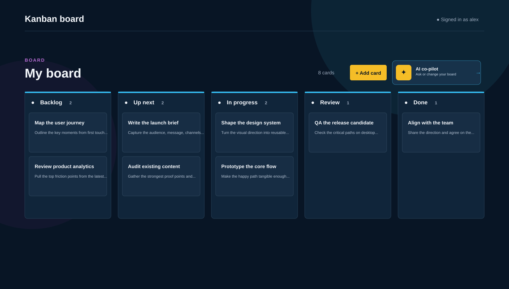

# Kanban Board

A polished Kanban project-management app with one persistent board, five renameable columns, drag-and-drop cards, demo sign-in, and an optional AI co-pilot.



## What It Does

- Displays one board with five seeded columns and example cards.
- Adds, edits, deletes, and reorders cards.
- Moves cards between columns with pointer or keyboard drag-and-drop.
- Renames columns.
- Persists board changes in a local JSON store through FastAPI.
- Provides demo sign-in with `user` / `password`.
- Provides an optional AI co-pilot that can answer board questions and request safe board updates.

The demo sign-in is not production authentication. The local JSON store is intended for development, not concurrent production use.

## Requirements

- Node.js 20 or later and npm
- Python 3.12 or later
- [uv](https://docs.astral.sh/uv/) for the backend
- Docker Compose, optional but recommended for the backend

## First-Time Setup

From the repository root:

```bash
cp .env.example .env
chmod 600 .env
```

Open `.env` and set `GROQ_API_KEY` if you want to use the AI co-pilot (get a free key at [console.groq.com](https://console.groq.com/keys) — no credit card required). Never put the key in `frontend/.env.local`, a `NEXT_PUBLIC_` variable, source code, tests, screenshots, or commit history. `.env` is ignored by Git.

## Start With Docker

Start the FastAPI backend:

```bash
./scripts/start.sh
```

The backend runs at `http://127.0.0.1:8000`. In a second terminal, start the frontend:

```bash
cd frontend
npm install
npm run dev
```

Open `http://localhost:3000`, or use the forwarded port URL supplied by Codespaces or your remote development environment.

## Start Without Docker

Install backend dependencies and run the API with uv:

```bash
cd backend
uv sync
uv run uvicorn app.main:app --host 127.0.0.1 --port 8000
```

`uv sync` creates `backend/.venv` and installs pinned dependencies from `uv.lock` automatically; there is no separate `pip install` step.

In a second terminal:

```bash
cd frontend
npm install
npm run dev
```

If port 8000 is occupied, use another backend port and configure the frontend before starting Next.js:

```bash
cd backend
uv run uvicorn app.main:app --host 127.0.0.1 --port 8001
```

```bash
cd frontend
KANBAN_BACKEND_URL=http://127.0.0.1:8001 npm run dev
```

## Using The App

1. Open the frontend.
2. Sign in with username `user` and password `password`.
3. Use the board controls to add, edit, delete, rename, and move cards.
4. Select the visible **AI co-pilot** control to open the assistant workspace.
5. Try `How many cards are there?` or `Rename Backlog to Ideas`.

Refreshing resets the demo sign-in state but does not reset the stored board data.

## AI Co-Pilot

The browser never calls Groq directly. Only the FastAPI backend reads `GROQ_API_KEY`.

```env
GROQ_API_KEY=your_local_key
GROQ_MODEL=openai/gpt-oss-20b
GROQ_TIMEOUT_MS=15000
```

Groq hosts OpenAI's open-weight `gpt-oss` models on its own inference hardware with a genuinely free tier (no credit card, no shared-pool congestion like typical free-tier aggregator models). The default model, `openai/gpt-oss-20b`, uses `reasoning_effort: "low"` to keep responses fast. Groq's free tier is still rate-limited (requests/tokens per minute, requests per day); a quota or provider error does not prevent normal Kanban use — close the assistant and continue using the board.

`/api/ai/chat` and `/api/ai/check` have no authentication of their own; they're rate-limited in-app to 10 requests/minute per client so a caller who bypasses the frontend sign-in can't burn through Groq's daily free quota on its own.

AI requests include the current board and a limited conversation history. The backend caps `max_tokens` per request and validates structured responses before the frontend applies a board update. Do not send passwords, API keys, or unrelated private information in chat prompts.

Ask the assistant to `undo` to revert the most recent board change it made. This is handled entirely on the frontend from a saved snapshot (no request to Groq) — the assistant is never shown prior board states, so it can't reconstruct an earlier layout on its own.

To check provider connectivity:

```bash
curl http://127.0.0.1:8000/api/ai/check
```

This requires a valid local key and consumes provider quota.

## Useful Endpoints

- `GET /health` - backend health check
- `GET /api/hello` - smoke-test response
- `GET /api/users/demo-user/board` - read the seeded board
- `PUT /api/users/demo-user/board` - save the board
- `GET /api/ai/check` - provider connectivity check
- `POST /api/ai/chat` - structured board-aware assistant request

## Validate Changes

Frontend:

```bash
cd frontend
npm run lint
npx tsc --noEmit
npm run test -- --run
npm run build
npm run test:e2e
```

Backend:

```bash
cd backend
uv run pytest -q
```

Playwright requires browser binaries and compatible system libraries. Live AI browser tests also require provider availability and consume quota, so AI behavior is primarily covered with mocked provider tests.

## Troubleshooting

### The frontend shows a backend or rewrite error

Confirm the backend is running:

```bash
curl http://127.0.0.1:8000/health
```

If using port 8001, restart Next.js with `KANBAN_BACKEND_URL=http://127.0.0.1:8001`.

### The AI assistant reports a rate limit or credit error

This is a Groq account or model quota limitation, not a Kanban board failure. Wait for the quota window to reset, or select another available model in `.env`.

### Reset the local board data

Stop the backend, remove `backend/data/kanban.json`, and start the backend again. The seeded board will be recreated.
