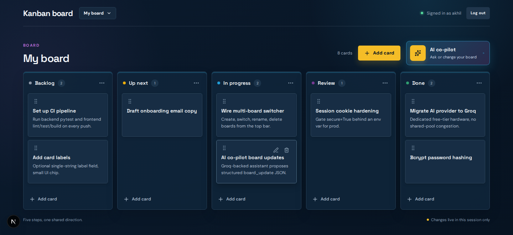
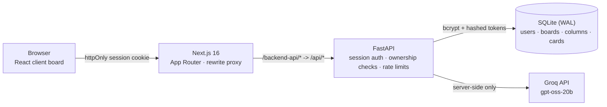
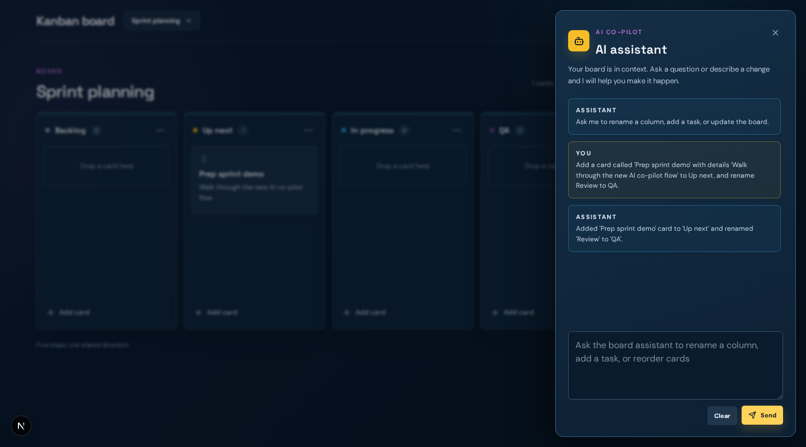

# Kanban Board

A full-stack, multi-user Kanban app - real accounts, private boards, drag-and-drop cards, and an AI co-pilot that can edit the board on your behalf. Built to demonstrate production-adjacent patterns (session auth, ownership-scoped data access, optimistic UI, structured LLM output) inside a deliberately small, well-tested scope.



## Highlights

- **Real auth, not a demo stub** - signup/login/logout/forgot-password, bcrypt-hashed passwords, server-side sessions via an httpOnly cookie (no JWT-in-localStorage), session/reset tokens stored only as SHA-256 hashes.
- **Multi-board data model** - every board query is ownership-scoped (`WHERE id = ? AND owner_id = ?`); a board that exists but isn't yours returns 404, not 403, so its existence is never leaked. Ships with an idempotent, `PRAGMA`-introspection-based migration that safely upgrades the original single-board schema in place.
- **Optimistic UI with race protection** - local edits apply instantly and roll back on a failed save; a save in flight for a board the user has since switched away from is discarded instead of clobbering the newly active board.
- **AI co-pilot with structured output** - the backend proxies to Groq, validates that every response is well-formed `{assistant_message, board_update?}` JSON before it ever reaches the UI, and retries once on a malformed or incomplete response. `GROQ_API_KEY` never reaches the browser.
- **Tested across three layers** - FastAPI unit/integration tests, Vitest + Testing Library component tests, and Playwright end-to-end tests (desktop and mobile viewports).

## Architecture



## AI Co-Pilot in Action

Ask it to read the board or change it - the same request handles both, since the assistant always gets the current board as context.

> **You:** Add a card called "Prep sprint demo" with details "Walk through the new AI co-pilot flow" to Up next, and rename Review to QA.
>
> **Assistant:** Added 'Prep sprint demo' card to 'Up next' and renamed 'Review' to 'QA'.



That single prompt touched two different parts of the board (a new card *and* a column rename) in one request. Under the hood: the backend forces the model into strict `{assistant_message, board_update?}` JSON, structurally validates every column *and card* in `board_update` before it's trusted, retries once if the model's response is malformed or claims a change it didn't actually include, and never lets `board_update` reach the UI unless it's provably well-formed - so a bad model response fails loudly server-side instead of silently corrupting the board client-side. Say `undo` afterward to revert the AI's last change instantly, no round trip required - it's restored from a local snapshot rather than asked of the model, since the assistant is never shown prior board states.

## Tech Stack

| Layer | Choices |
|---|---|
| Frontend | Next.js 16 (App Router, Turbopack), React 19, TypeScript, Tailwind CSS v4, `@dnd-kit` for drag-and-drop |
| Backend | FastAPI, SQLite (WAL mode), bcrypt, [uv](https://docs.astral.sh/uv/) for dependency management |
| AI | Groq (`openai/gpt-oss-20b`), server-side only, structured-response validation |
| Testing | pytest, Vitest + Testing Library, Playwright (e2e, multi-viewport) |
| Infra | Docker Compose for the backend |

## Quick Start

```bash
cp .env.example .env && chmod 600 .env
```

Set `GROQ_API_KEY` in `.env` to enable the AI co-pilot (free at [console.groq.com](https://console.groq.com/keys), no card required) - everything else works without it.

```bash
./scripts/start.sh          # backend, via Docker Compose -> http://127.0.0.1:8000
cd frontend && npm install && npm run dev   # -> http://localhost:3000
```

Prefer running the backend without Docker? `cd backend && uv sync && uv run uvicorn app.main:app --host 127.0.0.1 --port 8000`.

Sign up with any username/password to get a seeded board, then add cards, drag them between columns, create additional boards from the switcher in the top bar, and try the AI co-pilot with a prompt like `Rename Backlog to Ideas`.

## Testing

76 automated tests across three layers, all passing, plus a deliberate strategy for testing an AI feature that is non-deterministic by nature.

| Layer | Tool | Tests | Covers |
|---|---|---|---|
| Unit / integration | pytest | 41 | auth, sessions, board CRUD and ownership, schema migration, the AI proxy contract, rate limiting |
| Component | Vitest + Testing Library | 25 | sign-in/sign-up flows, board interactions, optimistic save/rollback, multi-board switching |
| End-to-end | Playwright (desktop + mobile viewports) | 10 | full user journeys in a real browser against a real backend |

### Testing an AI feature without flaky, expensive, non-deterministic tests

The AI co-pilot proxies to a live LLM, so calling the real model on every test run would be slow, flaky, and would burn API quota. Every AI-path test instead mocks the Groq HTTP call directly (`monkeypatch.setattr(main.httpx.AsyncClient, "post", fake_post)`) and asserts on the backend's own contract, not on what the model happens to say:

- **Malformed JSON from the model** - `test_ai_chat_retries_once_on_malformed_response_then_succeeds` and `test_ai_chat_fails_after_exhausting_retries_on_malformed_response` prove the one-retry-then-502 policy in both directions.
- **Hallucinated success** - `test_ai_chat_retries_when_assistant_claims_a_change_without_board_update` covers a real small-model failure mode: the assistant says "I renamed the column" but sends no `board_update`. The backend catches the claim with `CLAIMED_CHANGE_PATTERN` and forces a retry instead of trusting the text.
- **Field-name drift** - `test_ai_chat_retries_when_card_update_omits_title` is a regression test for a bug I found by hand while capturing a demo screenshot: the model returned a card using `name` instead of `title`. That shape passed the (then-incomplete) validation, saved silently failed, and the board rolled back while the chat still claimed success. Fixed by validating every card's `id`/`title`, not just column shape, and this test pins the fix down.
- **Provider failure modes** - dedicated tests for a 429 rate limit, a request timeout, a slow keep-alive stream, and a malformed connectivity-check response, so a Groq outage degrades predictably instead of hanging the UI.
- **Abuse protection** - `test_ai_rate_limit_blocks_excess_requests` verifies the per-IP limiter actually blocks past 10 req/min, since `/api/ai/chat` has no auth of its own.
- **Client-side AI behavior** - `reverts the last AI board update locally, without asking the AI to reconstruct it` verifies `undo` restores a local snapshot instead of round-tripping to the model, since the assistant is never shown prior board states and cannot reconstruct one.

### Test-driven bug reproduction

Two frontend tests exist because I reproduced real bugs first, then kept the reproduction as a permanent regression guard: `does not get stuck loading when clicking the already-active board in the switcher` (a `useEffect` dependency-array bug) and `does not let a stale save from a previous board overwrite the newly active board` (a race between an in-flight save and a board switch). Both bugs are fixed and both tests still run in the suite.

### Run it yourself

```bash
cd backend && uv run pytest -q
cd frontend && npm run lint && npx tsc --noEmit && npm run test -- --run && npm run build && npm run test:e2e
```

## Further Reading

This README is intentionally short. For the full data model, API surface, request-scoping rules, AI-proxy contract, and the reasoning behind specific design decisions, see [`CLAUDE.md`](CLAUDE.md) (technical/architecture reference) and [`AGENTS.md`](AGENTS.md) (original product requirements and coding standards).
